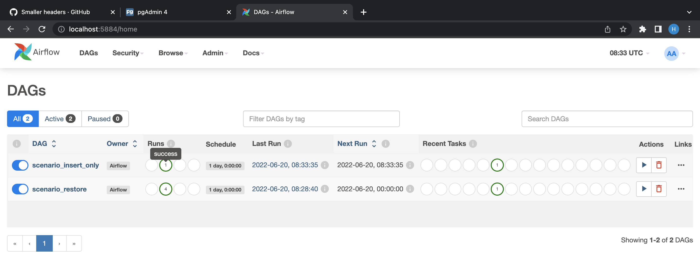

<h1>Docker: Airflow and PostgreSQL</h1>

<h3>A. Project structure</h3>

+ <strong>docker-compose.yml</strong>: including 4 main services and others
    + postgres: Database X, init POSTGRES_USER, POSTGRES_PASSWORD, POSTGRES_DB and data sample.
    + postgresy: Database Y, init POSTGRES_USER, POSTGRES_PASSWORD, POSTGRES_DB.
    + webserver: airflow webserver, connect with Database X. Expose port 8080 to 5884.
    + pgadmin4: web UI for inspecting Database X & Y.
    + others (redis, airflow-init,...): dependencies of airflow. 
  
+ <strong>db/init.sql</strong>: init table and data sample when creating Database X container.

+ <strong>dags/</strong>: predefined DAGs. Mapping from local folder to /opt/airflow/dags folder. There are two dags:
    + scenario_insert_only: in case that X has only insertion queries, not update. Python script queries only newest rows that be in X but not in Y and insert them to Y.
    + scenario_restore: in case that X has both insertion and updating queries. Python script truncates Y and query all rows of X, then writes to Y.

+ <strong>dags/script/</strong>: python scripts to connect, query and update data on postgre Database X & Y. DAGs will run these scripts.

+ <strong>logs/, plugins/</strong>: init folder for airflow.
  
<h3>B. Running flow</h3>

<ol>
  <li>Clone and <code>cd</code> into <strong>airflow-docker</strong> folder.</li>

  &nbsp;
  <li>Run: <code>docker-compose up -d</code></li>
  Wait a minute until all containers alread started. 

  &nbsp;
  <li>Go to <strong>localhost:1234</strong>. Login with user: 'huy@gmail.com' and password: 'postgres'.</li>
  
  

  &nbsp;
  <li>Add new server connection for Postgre Database X & Y.</li>
  a. Database name, Username and Password are 'airflow' for X and 'airflowy' for Y.
  
  

  &nbsp;
  b. Query table 'transactions' in X and Y.
  
  

  &nbsp;
  <li>Go to <strong>localhost:5884</strong>. Login with user: 'airflow' and password: 'airflow'.</li>
  
  

  &nbsp;
  <li>Trigger DAGs.</li>

  Turn on task:
  &nbsp;
  
  
  &nbsp;
  Trigger manual:
  &nbsp;
  

  &nbsp;
  Refresh and wait until task sucessful:
  &nbsp;
  

  <li>Query DB Y again.</li>
  

  &nbsp;
  <li>Run: <code>docker-compose stop</code> to stop.</li>
</ol>

<h2>End.</h2>
